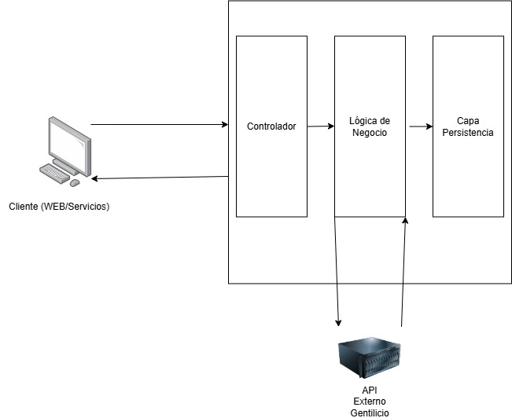

# Customer Management API

Esta API proporciona funcionalidades CRUD para gestionar clientes.

## Descripción

La API de Gestión de Clientes permite crear, leer, actualizar y eliminar información de clientes. Utiliza Quarkus, Hibernate ORM, PostgreSQL y MicroProfile OpenAPI para una solución robusta y bien documentada.

### Arquitectura



El proyecto sigue una arquitectura limpia y modular, donde cada clase tiene responsabilidades claras:

- **CustomerResource**: Define los endpoints de la API para crear, leer, actualizar y eliminar clientes.
- **CustomerService**: Contiene la lógica de negocio para manejar las operaciones CRUD de los clientes.
- **ApiResponse**: Estandariza las respuestas de la API, proporcionando un formato consistente.
- **Customer**: Representa la entidad de cliente que se almacenará en la base de datos.

### Decisiones de diseño

- **Uso de Quarkus**: Elegimos Quarkus porque ofrece tiempos de inicio rápidos y un bajo consumo de memoria, lo cual es ideal para aplicaciones de microservicios.
- **PostgreSQL como base de datos**: Usamos PostgreSQL para almacenar los datos de los clientes, ya que es una base de datos relacional robusta que proporciona soporte para consultas complejas y transacciones.
- **Flyway para la migración de bases de datos**: Usamos Flyway para gestionar el esquema de la base de datos de manera versionada. Esto facilita la administración de cambios en la base de datos durante el ciclo de vida del proyecto.
- **SmallRye OpenAPI para documentación de la API**: Utilizamos SmallRye OpenAPI para generar la documentación de la API de manera automática y accesible a través de Swagger UI.

## Tecnologías Utilizadas

-   **Quarkus:** Framework Java nativo de Kubernetes.
-   **Hibernate ORM:** ORM para la persistencia de datos.
-   **PostgreSQL:** Base de datos relacional.
-   **MicroProfile OpenAPI:** Generación automática de documentación OpenAPI (Swagger).
-   **JAX-RS:** Para la creación de servicios RESTful.
-   **Jakarta Validation:** Para la validación de datos de entrada.
-   **Flyway:** Para la gestión de migraciones de base de datos.
-   **RestClient:** Para consumir servicios externos.

## Requisitos

-   Java 21+
-   Docker (opcional, para ejecutar PostgreSQL)
-   Maven o Gradle

## Endpoints

### 1. **Crear un cliente**

- **Método**: `POST`
- **Ruta**: `/customers`
- **Descripción**: Crea un nuevo cliente en la base de datos.
- **Cuerpo de la solicitud**:
  ```json
  {
    "firstName": "Juan",
    "middleName": "Jose",
    "lastName": "Perez",
    "secondLastName": "Ramirez",
    "email": "juanjopr@example.com",
    "address": "1234 Elm Street",
    "phone": "+1234567890",
    "country": "US"
  } 
  ```
- **Respuestas**:
  - 201 Created: Cliente creado correctamente. 
  - 400 Bad Request: Los datos proporcionados no son válidos.

    Ejemplo respuesta exitosa:
    ```json
    {
      "status": "success",
      "data": {
        "id": 1,
        "firstName": "Juan",
        "middleName": "Jose",
        "lastName": "Perez",
        "secondLastName": "Ramirez",
        "email": "juanjopr@example.com",
        "address": "1234 Elm Street",
        "phone": "+1234567890",
        "country": "US",
        "demonym": "American"
      },
      "message": "Customer created successfully"
    }
    ```

### 2. **Obtener todos los clientes**

- **Método**: `GET`
- **Ruta**: `/customers`
- **Descripción**: Obtiene todos los clientes, con la opción de filtrar por país.
- **Parámetros de consulta**:
  - country (opcional): Filtra los clientes por el país especificado.
- **Respuestas**:
    - 200 Ok: Clientes obtenidos correctamente.
    - 404 Not Found:  No se encontraron clientes.

      Ejemplo respuesta exitosa:
      ```json
      {
        "status": "success",
        "data": [ 
           {
            "id": 1,
            "firstName": "Juan",
            "middleName": "Jose",
            "lastName": "Perez",
            "secondLastName": "Ramirez",
            "email": "juanjopr@example.com",
            "address": "1234 Elm Street",
            "phone": "+1234567890",
            "country": "US",
            "demonym": "American"
          }
        ],
        "message": "Customer created successfully"
      }
      ```

### 3. **Obtener un cliente por ID**

- **Método**: `GET`
- **Ruta**: `/customers/{id}`
- **Descripción**: Obtiene un cliente específico basado en su ID.
- **Parámetros de consulta**:
    - id (obligatorio): El ID del cliente.
- **Respuestas**:
    - 200 Ok: Cliente obtenido correctamente.
    - 404 Not Found:  No se encontro al cliente.

      Ejemplo respuesta exitosa:
      ```json
      {
        "status": "success",
        "data": {
           "id": 1,
           "firstName": "Juan",
           "middleName": "Jose",
           "lastName": "Perez",
           "secondLastName": "Ramirez",
           "email": "juanjopr@example.com",
           "address": "1234 Elm Street",
           "phone": "+1234567890",
           "country": "US",
           "demonym": "American"
         },
        "message": "Customer created successfully"
      }
      ```

### 4. **Actualizar un cliente**

- **Método**: `PATCH`
- **Ruta**: `/customers/{id}`
- **Descripción**: Actualiza la información de un cliente específico.
- **Parámetros**:
    - id (obligatorio): El ID del cliente a actualizar.
- **Cuerpo de la solicitud**:
  ```json
  {
    "email": "juanjopr@example.com",
    "address": "1234 Elm Street",
    "phone": "+1234567890",
    "country": "US"
  } 
  ```
- **Respuestas**:
    - 200 Ok: Cliente obtenido correctamente.
    - 404 Not Found:  No se encontro al cliente.
    - 400 Bad Request: Los datos de actualización no son válidos.

      Ejemplo respuesta exitosa:
      ```json
      {
        "status": "success",
        "data": {
           "id": 1,
           "firstName": "Juan",
           "middleName": "Jose",
           "lastName": "Perez",
           "secondLastName": "Ramirez",
           "email": "juanjopr@example.com",
           "address": "1234 Elm Street",
           "phone": "+1234567890",
           "country": "US",
           "demonym": "American"
         },
        "message": "Customer created successfully"
      }
      ```
  ### 5. **Eliminar un cliente**

- **Método**: `DELETE`
- **Ruta**: `/customers/{id}`
- **Descripción**: Elimina un cliente específico basado en su ID.
- **Parámetros**:
    - id (obligatorio): El ID del cliente a eliminar.
- **Respuestas**:
    - 200 Ok: Cliente obtenido correctamente.
    - 404 Not Found:  No se encontro al cliente.

## Swagger UI
Una vez que la aplicación esté corriendo, podrás acceder a la documentación interactiva de la API a través de:

- Swagger UI: http://localhost:8080/q/swagger-ui
- OpenAPI JSON: http://localhost:8080/openapi


